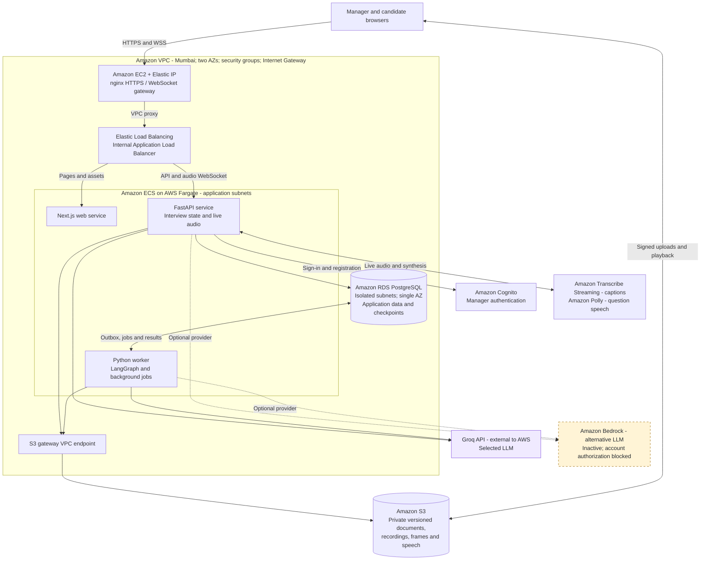
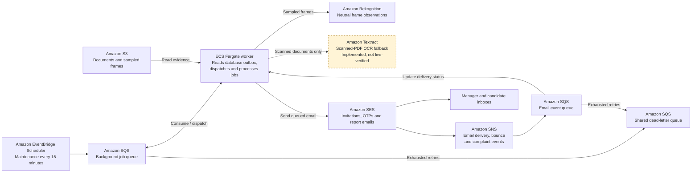
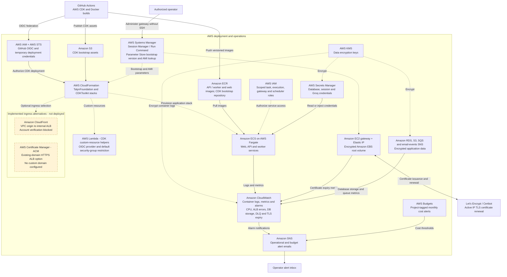

# Talyn

An AWS-hosted, multi-tenant AI interview workspace. Managers approve a consistent rubric, candidates complete a consent-based interview, and reports link assessments to transcript evidence. Hiring decisions remain with people.

**Live development site: https://13.204.206.74**. Choose **Open your workspace** to sign in or create an account. The complete real-provider cloud interview test passed using synthetic data and SES simulator recipients. [Verification evidence](docs/acceptance.md) separates live checks from local fixtures and production prerequisites.

The user selected Groq because this AWS account blocks Bedrock. Groq inference is configured server-side in Secrets Manager; HTTPS uses a static IP and trusted certificate because no domain is available and CloudFront is account-blocked. The local synthetic demo runs separately, with clearly labeled fixture results.

Stack: Next.js / React / TypeScript, FastAPI / SQLAlchemy / Alembic, LangGraph, PostgreSQL and AWS CDK. Runtime integrates Cognito, S3, Transcribe Streaming, Polly, SES, SQS and Rekognition. LLM inference supports Bedrock and the explicitly authorized Groq alternative. Groq sends planning/answer text outside AWS, disclosed before consent.

## Architecture

The diagrams cover the deployed application and its deployment, security and operations services. Regional resources run in **ap-south-1 (Mumbai)**. Solid arrows show active flows or dependencies; dashed arrows show administration, provisioning or explicitly labelled optional paths. Resource coverage was checked against the live `TalynFoundation` and `CDKToolkit` CloudFormation stacks and the application service integrations.

### Interview and data flow



Candidate invitation/OTP sessions are managed by the API and database; Cognito handles manager accounts. Fargate tasks use public IPs for outbound access, with inbound application traffic restricted to the ALB security group. RDS is isolated and there is no NAT gateway.

### Background processing and notifications



The API writes durable jobs to the database outbox; the worker publishes them to SQS. Video observations remain separate from competency scoring. SES notifications and their delivery events use separate paths through SNS and SQS.

### Deployment, security and operations



Lambda functions here support CDK provisioning; interview processing runs in Fargate. Current HTTPS uses the EC2 gateway and Let's Encrypt. CloudFront and ACM are optional alternatives shown with their deployment status; Route 53 is not provisioned. Textract is implemented and permissioned but awaits a live scanned-PDF test. Bedrock remains inactive while Groq is selected. See [architecture decisions](docs/architecture.md), [verification evidence](docs/acceptance.md) and [account blockers](docs/aws-blockers.md).

## Run locally

With Docker Desktop running, from the repository root:

```sh
docker compose up --build -d
```

Open http://localhost:3000, choose **Open your workspace**, then **Enter synthetic demo**. Create an organization and role, add a synthetic candidate, upload a resume, prepare and approve the interview, then launch invitations. Notifications contains the simulated invitation link and verification code. Use a separate browser profile for candidate access. With consent, the candidate page records real camera/microphone clips; demo answers use the explicitly labeled synthetic input. Reports include evidence and independently playable clips. Demo mode sends no external email and makes no AWS AI calls.

The landing page and shared application theme adapt the user's private Nightshift reference: charcoal, acid yellow, large Anton headlines, Archivo body text and IBM Plex Mono labels. Fonts are self-hosted. Landing motion can be paused and respects reduced-motion preferences. The authenticated workspace is at `/workspace`; candidate invitations open `/interview`.

Generate sample documents and automated browser media with `cd backend`, `uv sync --frozen`, then `uv run python ../scripts/create_fixtures.py`. Files appear in `frontend/test-fixtures/`. For a lightweight Windows setup with Python 3.12, Node 22 and uv installed, run `powershell -File scripts/dev.ps1`; this uses SQLite instead of Docker PostgreSQL.

`docker compose stop` stops local containers and preserves demo data. Bindings are localhost only. The Compose password is exclusively a disposable local development credential. Do not expose the demo publicly.

## Hiring manager upload samples

The [demo upload kit](demo-upload-kit/START-HERE.txt) contains three fictional resumes in PDF and DOCX, a candidate CSV, an optional project brief, and job fields matching the current website. Upload either format of each resume, not both. The bulk CSV uses placeholder addresses for importing/preparing candidates; use a verified and allowed inbox for live invitation tests. A local `03-candidate-self-test.csv`, when generated, is excluded from Git.

The included documents are ready to upload. To regenerate them on Windows with Node.js and Microsoft Word installed:

```powershell
npm install --prefix .local/demo-kit-tools --save-exact --no-audit --no-fund docx@9.7.1
$env:NODE_PATH=(Resolve-Path '.local/demo-kit-tools/node_modules').Path
node scripts/create_demo_upload_kit.cjs --self-email your-verified-address@example.com
./scripts/export_demo_pdfs.ps1
```

Replace the example email with your verified inbox. Generation sends no email and creates no AWS jobs. All eight PDF/DOCX files were checked with Talyn's isolated document parser; DOCX schema checks and visual review of every exported PDF page passed. Candidate CSVs and job fields were checked against the application's input schemas.

## Checks

```sh
cd backend
uv sync --frozen
uv run ruff check app tests
uv run pytest -q
uv run alembic upgrade head
uv run alembic check
uv run python ../scripts/create_fixtures.py
cd ../frontend
npm ci
npx playwright install chromium
npm run typecheck
npm run test:audio
npm run build
npm run test:e2e
cd ../infra
npm ci
npm run build
npm test
```

CI repeats backend tests against a separate PostgreSQL database. Tests reset only a database named `talyn_test`; never provide a production database URL. Browser tests use fixture media and simulated recipients.

See [architecture](docs/architecture.md), [deployment and rollback](docs/deployment.md), [operations](docs/operations.md), [costs](docs/costs.md), and [limitations](docs/limitations.md). No Kaggle data or training is required. `task.txt`, credentials, local data, generated browser fixtures and build artifacts are excluded by `.gitignore`.
